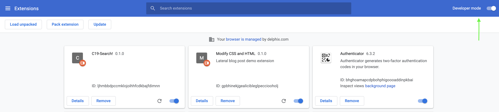
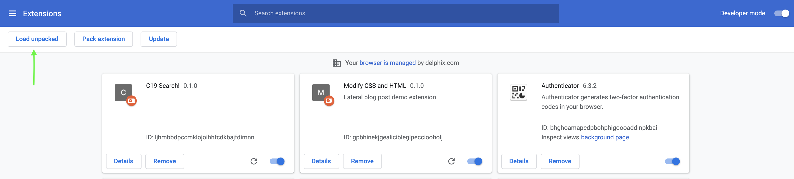
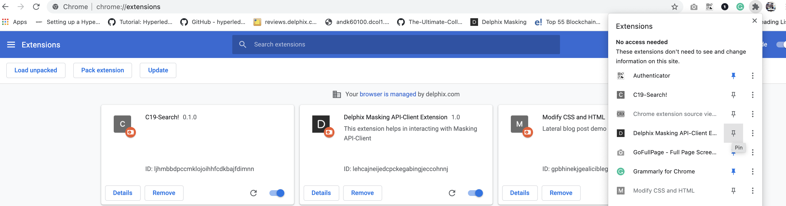
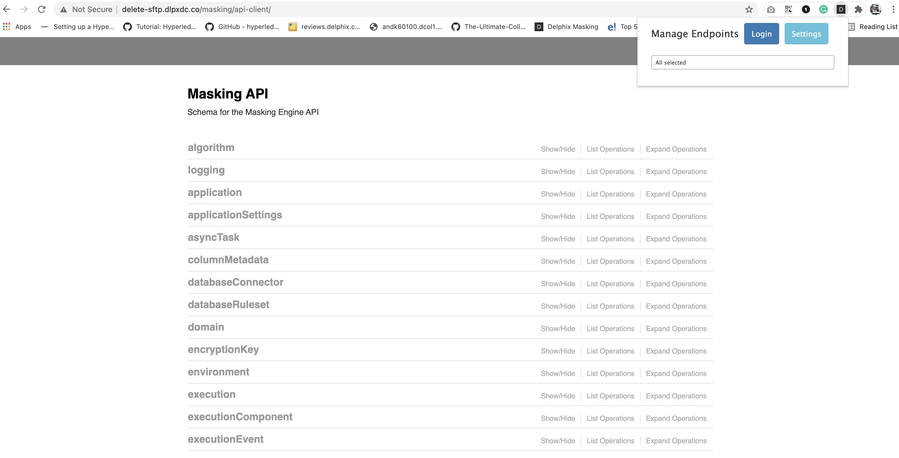
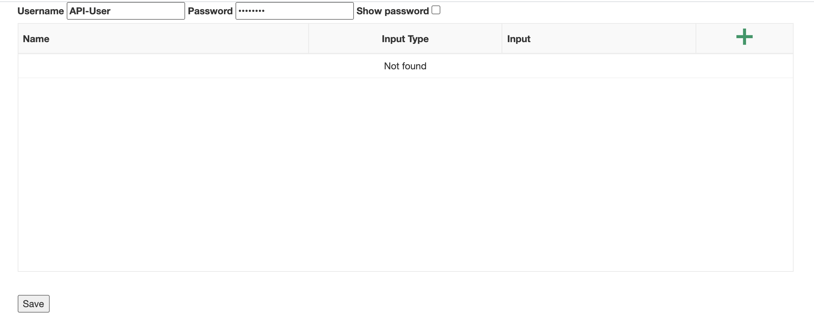
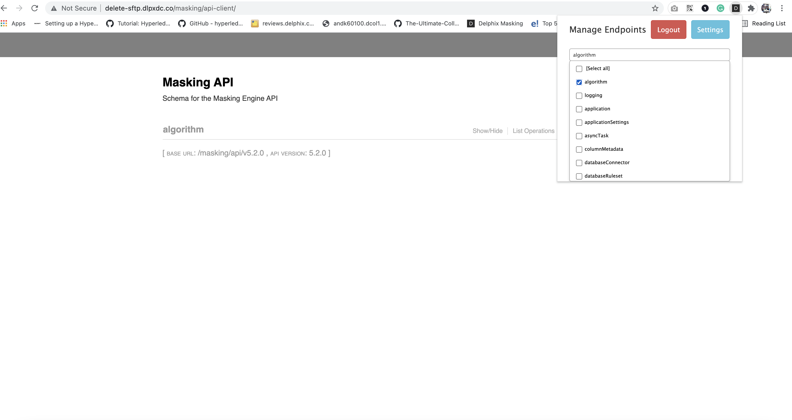
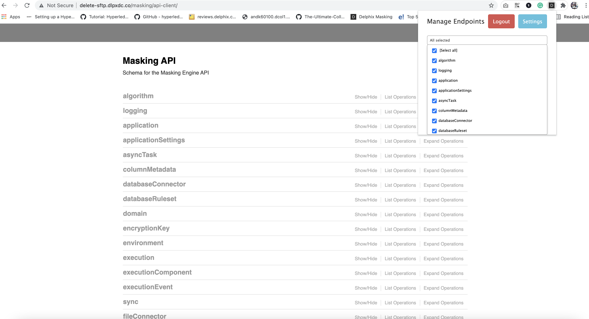

# Description

This chrome extension helps anyone consuming the API (Customers, Field, Support, Developers, etc. )
in interacting easily with Masking API-Client.

# Version

The current `2.X` version is `2.0.0`.

Please see the [Change log](CHANGELOG.md) for
information on each version.

# Note:
Please note that if you are using Masking Engine Version <= 6.0.16.0 then only v1.0.0
will work. For Masking Engine > 6.0.16.0 versions please download and use v2.0.0

# Install

To install this chrome extension follow the below steps:

1. Download the new release zip file under the "release" menu option. Or you can directly download the extension zip
file from [here](https://github.com/delphix/Delphix-Masking-API-Client-Extension/archive/refs/heads/master.zip) , and
unzip on your laptop/computer.
2. Go to [chrome://extensions/](chrome://extensions/) and check the box for Developer mode in the top right.

3. Click on "Load Unpacked" button and select your unzip folder and navigate to "extension/chrome" folder(You need to select the folder in
which the manifest file exists).

4. Once you will select the "extension/chrome" folder, the extension will be installed now.
5. Click on "Extensions" icon on top right corner and pin the newly installed chrome extension to chrome tool bar.

# Usage

Follow the below steps to setup the extension,

1. Open your Masking API client page like http://<hostanme>/masking/api-client/ , if your page is already opened reload
the page to reflect the extension.
2. Click on installed extension icon, it will open the extension popup as displayed in the below screenshot.

3. Click on "Settings" button, it will open a popup page where you need to enter and save your default username and
password for the API client login.

4. Once you will configure your username/passowrd for API login, extension is ready to use. Now you can enjoy the single
click login and API extension filter options accordingly.

# Contribute

1.  Fork the project.
2.  Make your bug fix or new feature.
3.  Add tests for your code.
4.  Send a pull request.

Contributions must be signed as `User Name <user@email.com>`. Make sure to [set up Git with user name and email address](https://git-scm.com/book/en/v2/Getting-Started-First-Time-Git-Setup). Bug fixes should branch from the current stable branch. New features should be based on the `master` branch.

### Code of Conduct

This project operates under the [Delphix Code of Conduct](https://delphix.github.io/code-of-conduct.html). By participating in this project you agree to abide by its terms.

### Contributor Agreement

All contributors are required to sign the Delphix Contributor agreement prior to contributing code to an open source repository. This process is handled automatically by [cla-assistant](https://cla-assistant.io/). Simply open a pull request and a bot will automatically check to see if you have signed the latest agreement. If not, you will be prompted to do so as part of the pull request process.

# Reporting Issues

Issues should be reported in the GitHub repo's issue tab. Include a link to it.

# Statement of Support

This software is provided as-is, without warranty of any kind or commercial support through Delphix. See the associated license for additional details. Questions, issues, feature requests, and contributions should be directed to the community as outlined in the [Delphix Community Guidelines](https://delphix.github.io/community-guidelines.html).

# License

This is code is licensed under the Apache License 2.0. Full license is available [here](./LICENSE).
